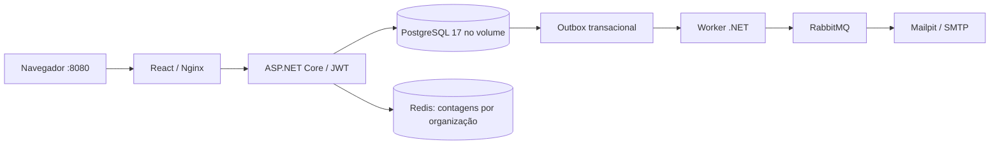
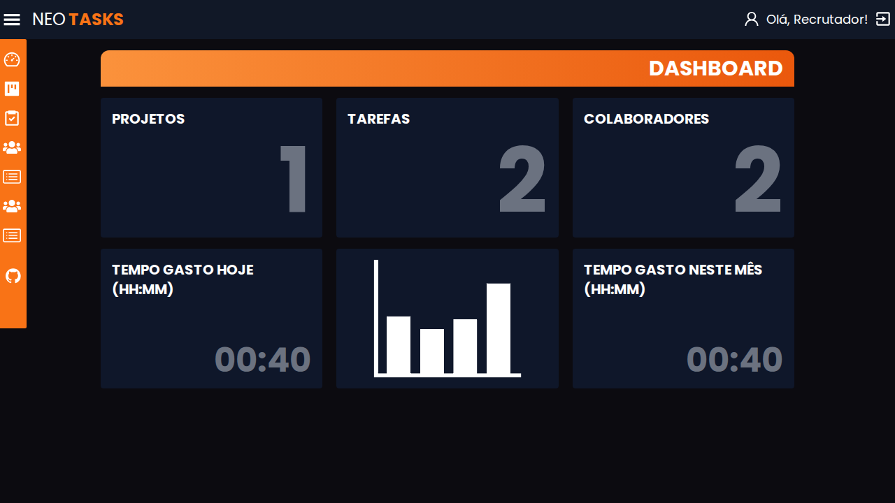
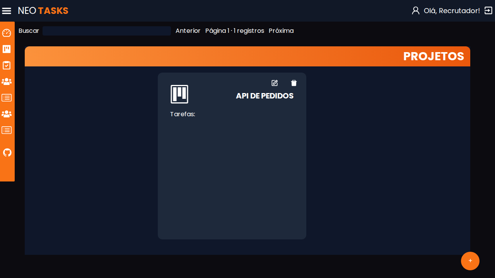
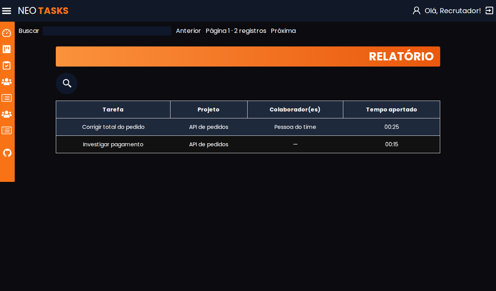
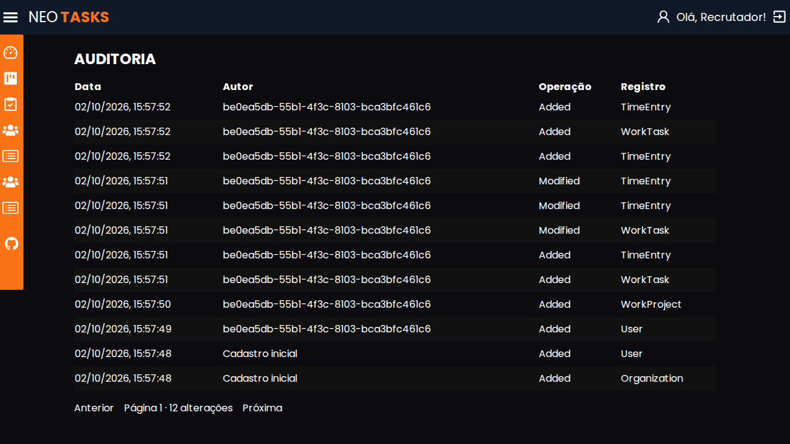

# NeoTasks — React + .NET

NeoTasks é uma aplicação full stack de tarefas e apontamento de horas. Juntei a interface React do desafio original a uma API em C#/.NET. O projeto permite criar uma organização, cadastrar colaboradores, organizar tarefas por projeto e registrar o tempo de trabalho. Mantive o visual e os componentes da interface original e adaptei o contrato para o novo backend. Incluí recuperação de senha por e-mail, confirmação de endereço, renovação de sessão, auditoria e busca paginada.

## Para avaliar o projeto

Você precisa de Git e Docker com Compose. Não precisa instalar Node, .NET ou um banco separado.

```sh
git clone https://github.com/LucianoNeo/neotasks.git
cd neotasks
docker compose up --build
```

Abra **http://localhost:8080**. Clique em **Criar uma organização** e cadastre seu nome, organização, e-mail e senha com pelo menos 12 caracteres. Esse primeiro usuário será o administrador. Não há conta compartilhada nem dados de produção.

Um roteiro de cinco minutos:

1. Crie um projeto no menu Projetos.
2. Cadastre uma pessoa em Colaboradores. Ela poderá entrar com o e-mail e a senha inicial informados.
3. Crie uma tarefa e atribua um colaborador.
4. Use Iniciar e Finalizar para registrar o tempo, ou informe um período já trabalhado.
5. Confira o Dashboard e o Relatório. Saia e entre como colaborador para comparar as permissões.
6. Abra **http://localhost:8025**: a caixa Mailpit recebe os e-mails desta instalação. Use a mensagem de confirmação para validar seu endereço.
7. Ao atribuir uma tarefa, o worker envia uma notificação para o mesmo Mailpit; confira a mensagem na caixa de entrada.
8. No login, escolha **Esqueci minha senha**, abra o e-mail na caixa e defina uma nova senha. O link expira em uma hora e só pode ser usado uma vez.
9. Entre como Owner e consulte **Auditoria**. Use a busca e as páginas em Projetos e Tarefas.

O Docker baixa e compila as imagens na primeira execução. A API aguarda a criação do banco e a interface aguarda a API ficar saudável. A porta da API fica apenas na rede interna; o Nginx encaminha as chamadas da interface.

## Parar, retomar e preservar dados

```sh
docker compose down
docker compose up -d
```

O volume `neotasks-postgres` preserva usuários, projetos, tarefas e horas, inclusive após reiniciar os containers. `docker compose down -v` apaga esse banco; use apenas se quiser recomeçar a avaliação.

Se a porta 8080 estiver ocupada, copie `.env.example` para `.env` e mude `NEOTASKS_PORT`. A senha do banco pode ser configurada em `NEOTASKS_DB_PASSWORD`. O PostgreSQL fica apenas na rede interna do Compose. A configuração de exemplo só publica em 127.0.0.1. Ela inclui uma chave JWT conhecida para facilitar a avaliação local; substitua `NEOTASKS_JWT_KEY` por uma chave própria de pelo menos 32 bytes antes de disponibilizar a aplicação a terceiros.

## Como está organizado

| Pasta/arquivo | Responsabilidade |
| --- | --- |
| `frontend/` | React 18, TypeScript, Vite e Tailwind; interface original adaptada |
| `NeoTasks.Api/` | ASP.NET Core .NET 10, autenticação, endpoints e composição das dependências |
| `NeoTasks.Domain/` | Entidades e regras centrais, sem dependência de EF Core |
| `NeoTasks.Data/` | EF Core, PostgreSQL, migrations, repositórios e persistência do outbox |
| `NeoTasks.Service/` | Casos de uso CQRS, Mediator e validação FluentValidation |
| `NeoTasks.Worker/` | Publicação confiável do outbox no RabbitMQ e e-mails de atribuição |
| `NeoTasks.Tests/` | Testes de integração com banco PostgreSQL real |
| `compose.yaml` | API, worker, PostgreSQL, Redis, RabbitMQ, Nginx e Mailpit |



O Nginx atende a interface e encaminha `/app-api` à API na mesma origem. Esse grupo devolve os formatos usados pelos componentes React: projetos com `Tasks`, tarefas com `TimeTracker` e colaboradores sem dados de senha. As rotas anteriores `/auth` e `/api` continuam disponíveis para clientes da API; `examples.http` mostra esse contrato. `/health` verifica disponibilidade. O OpenAPI em `/openapi/v1.json` fica disponível apenas em Development.

A organização vem das claims do JWT. IDs de outra organização retornam 404. Somente Owner cria, edita ou exclui projetos e cadastra colaboradores; membros trabalham nas tarefas e nos apontamentos da própria organização. Senhas usam ASP.NET Core PasswordHasher. Tarefas e apontamentos usam controle de concorrência; uma versão de tarefa desatualizada retorna 409. Horários são armazenados em UTC e os totais consideram o fuso enviado pelo navegador, dividindo apontamentos que atravessam a meia-noite.

## Testes locais

Com o SDK .NET 10 e o Docker ativos, inicie o PostgreSQL de desenvolvimento antes dos testes. O usuário `neotasks` do Compose pode criar o banco temporário isolado usado por cada execução:

```sh
docker compose up -d db
```

PowerShell:

```powershell
$env:NEOTASKS_TEST_DATABASE = 'Host=localhost;Database=postgres;Username=neotasks;Password=neotasks-local-only'
dotnet test NeoTasks.Tests/NeoTasks.Tests.csproj
```

Linux/macOS:

```sh
NEOTASKS_TEST_DATABASE='Host=localhost;Database=postgres;Username=neotasks;Password=neotasks-local-only' dotnet test NeoTasks.Tests/NeoTasks.Tests.csproj
```

Esses comandos extras são opcionais para quem quiser estudar ou modificar o código. A avaliação pelo navegador exige apenas o Compose.

## Origem e regras da aplicação

A interface veio de [ingacode-test-frontend](https://github.com/LucianoNeo/ingacode-test-frontend), commit `2083dfc646e7f3aee84caab673dee1c0bd902685`. O domínio foi inspirado no [backend original em Fastify](https://github.com/LucianoNeo/ingacode-test-backend). Nesta pasta, a interface usa exclusivamente a API .NET; não depende daqueles serviços externos.

A instalação usa PostgreSQL 17 e migrations do EF Core, aplicadas na inicialização. A atualização reconhece o esquema das versões anteriores que usavam EnsureCreated e o adota como baseline sem apagar usuários, projetos ou tarefas. O teste de integração cobre essa atualização.

A sessão usa JWT de 30 minutos e um refresh token de sete dias em cookie HttpOnly/SameSite. O navegador renova o acesso automaticamente; cada renovação consome o token anterior. O banco guarda apenas hashes dos tokens de acesso por link e de renovação. Uma redefinição de senha encerra as sessões anteriores. Login, cadastro, recuperação, confirmação e renovação têm limitação de tentativas.

A confirmação de e-mail informa o estado da conta em **Minha conta**. Ela não impede a avaliação das telas antes de abrir a mensagem. A recuperação responde da mesma maneira para endereços existentes ou desconhecidos. Mailpit captura os e-mails no Compose e não os envia a caixas externas. Em uma hospedagem própria, configure `Mail__Host`, `Mail__Port`, `Mail__UseTls`, `Mail__Username`, `Mail__Password`, `Mail__From` e `PublicUrl` para seu servidor SMTP e endereço público.

Projetos e tarefas aceitam `page` e `q`; tarefas também aceitam `filterBy` para nome, projeto ou colaborador. A API retorna até 20 registros por página e o total em `X-Total-Count`. A interface permite percorrer as páginas e pesquisar no servidor. Os seletores carregam nomes e IDs de projetos, independentemente da página visível. A auditoria é paginada e filtrada pela organização do usuário; somente Owner a consulta.

Apontamentos abertos não entram no total até serem finalizados; cada apontamento aceita até 24 horas. Lançamentos feitos pela rota de segundos entram no total por tarefa, enquanto os totais de calendário usam períodos com início e fim. As tabelas têm chaves e vínculos por organização, além das validações de acesso da API.

## Telas

Capturas da aplicação completa com dados fictícios.









## English

A full-stack React and ASP.NET Core application for task management and time tracking. Clone this repository, run `docker compose up --build` from its root and visit **http://localhost:8080**. Create an organization first; its first user becomes Owner. Owners manage projects and team members; members manage their organization's tasks and time entries. PostgreSQL data survives container restarts through a named volume.

The solution separates API, Domain, Data, Service and Worker projects. Mediator handlers validate use cases; Redis caches tenant-scoped dashboard counts; a transactional outbox feeds RabbitMQ so task-assignment e-mails can be handled asynchronously. Account recovery, email confirmation, rotating sessions, audit history, server-side search/pagination and versioned EF migrations are included. Open **http://localhost:8025** to read the local demo emails.
